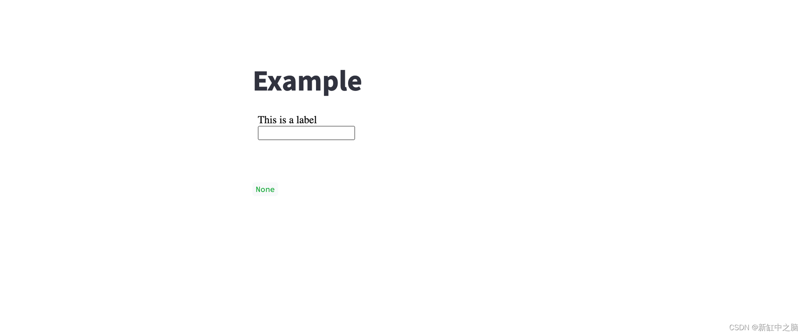
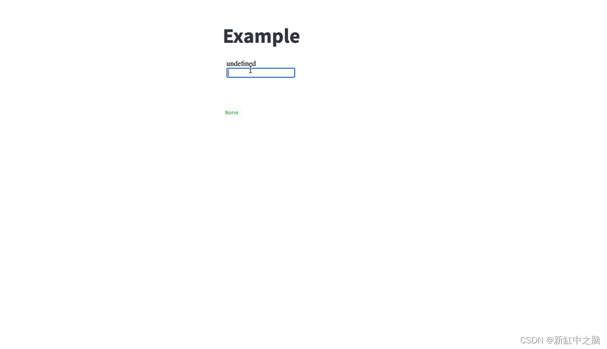
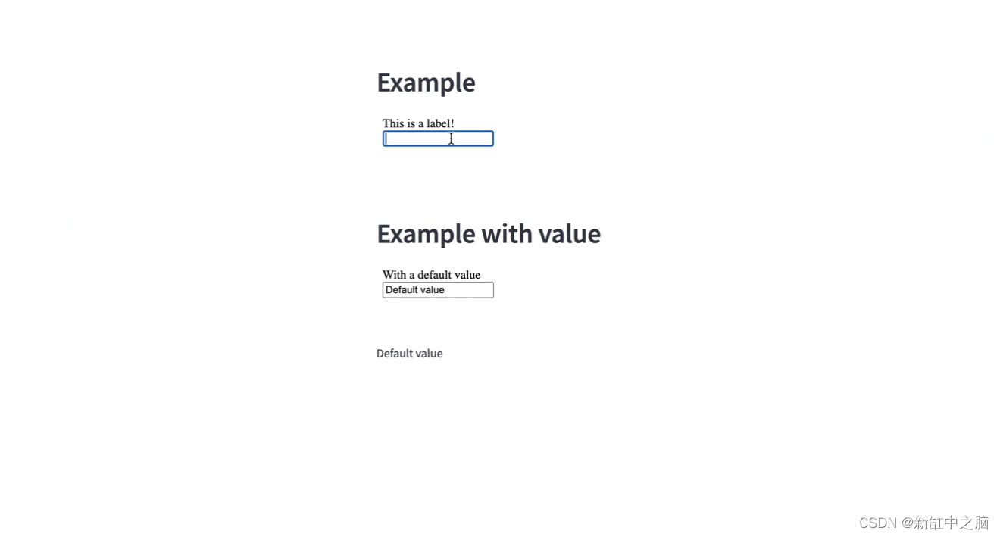
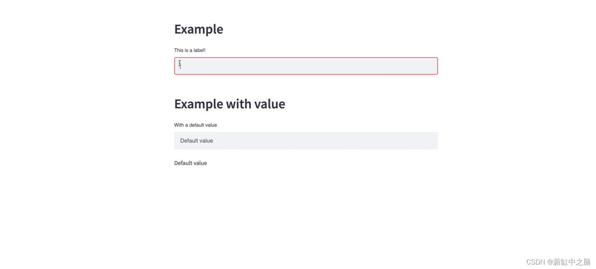
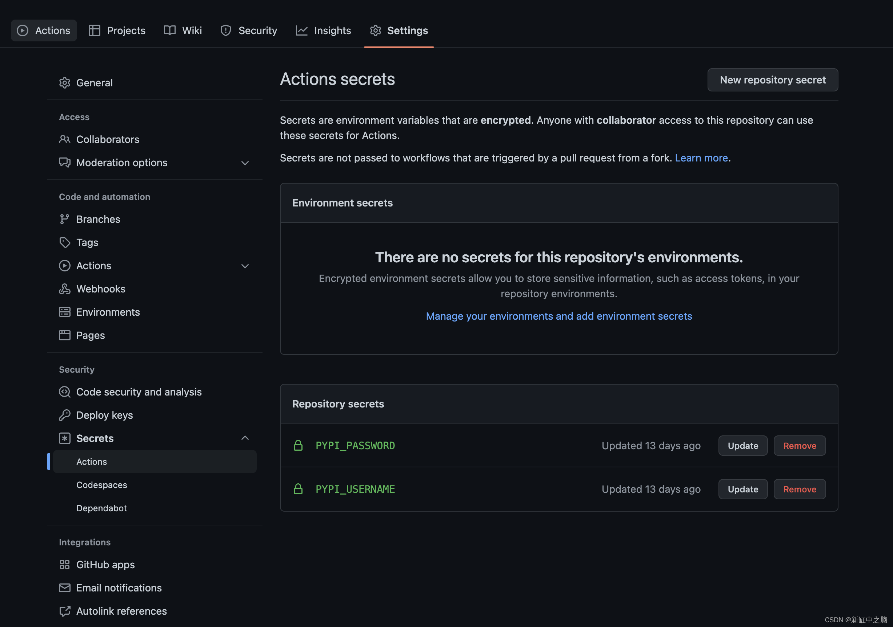

## Streamlit自定义组件开发教程

[参考文章1](https://blog.csdn.net/shebao3333/article/details/128726301)

### 什么是Streamlit组件？

Streamlit 组件是一个可共享的 Streamlit 插件，可让你为应用程序添加新的视觉效果和交互性。

为什么要使用或构建Streamlit组件？

因为尽管 Streamlit 具有大量内置功能，但有时你可能希望向 Streamlit（尚）不可用的应用程序添加可视化或交互性，然后与社区共享。

有三种类型的组件：

- 仅限 Python 的组件：不需要自定义 HTML/JavaScript 的 Python 代码。
- 静态组件：Python + HTML/JavaScript，可以嵌入到你的应用程序中。
- 双向组件：Python + HTML/JavaScript，可以嵌入到你的应用程序中，并且可以将数据返回给它。

想知道要构建哪些组件？以下是一些思路：

- 在 Streamlit 中不可用的新 baseweb 组件。
- 一个可点击的图表，可让你在应用中使用点击的值。
- 一个文本输入框，在你键入时返回值 - 不需要“输入”（这就是我们将在本文中共同构建的内容）。
- 查看社区组件跟踪器，了解已经构建了哪些类型的组件。

### Streamlit组件开发#1 — 创建样板代码

Cruft 为你提供预先存在的项目模板。可以使用 pip、pipx 或 brew 安装它，然后运行以下命令：

```sh
cruft create https://github.com/blackary/cookiecutter-streamlit-component/
```

接下来，输入组件的详细信息：

```sh
author_name [Bob Smith]: Zachary Blackwood
author_email [bob@example.com]: example@example.com            
project_name [Streamlit Component X]: Streamlit Keyup
package_name [streamlit-keyup]: streamlit-keyup
import_name [streamlit_keyup]: st_keyup 
description [Streamlit component that allows you to do X]: A streamlit component that allows you to get input from a textbox after every key press
deployment_via_github_actions [y]: y
Select open_source_license:
1 - MIT license
2 - BSD license
3 - ISC license
4 - Apache Software License 2.0
5 - GNU General Public License v3
6 - Not open source
Choose from 1, 2, 3, 4, 5, 6 [1]: 1
```

> 注意：可以随心所欲地调用你的组件。但是，如果你希望它可以通过GitHub操作轻松地在PyPI上发布，请在deployment_via_github_actions问题中输入y。这是默认值，因此在必须接受它时按下即可。

此模板将创建以下目录结构：

``` sh
streamlit-keyup
├── .cruft.json
├── .github
│   └── workflows
│       └── publish_PYPI_each_tag.yml
├── .gitignore
├── LICENSE
├── MANIFEST.in
├── README.md
├── requirements.txt
├── setup.py
└── src
    └── st_keyup
        ├── __init__.py
        └── frontend
            ├── index.html
            ├── main.js
            ├── streamlit-component-lib.js
            └── style.css
```

如果要将这个包作为 streamlit-keyup 发布，则会生成此布局，因此这些是 package_name 和 import_name 的值。

### 3、Streamlit组件开发#2 — 添加基本网页

Cruft 将创建一个html文件 `src/st_keyup/frontend/index.html` 。
只需在`<body>`中添加新标签：

```html
<body>
  <div id="root">
    <label id="label" for="text_input">This is a label</label>
    <div class="input">
	  <input type="text" name="text_input" id="input_box" />
    </div>
  </div>
</body>
```

接下来运行:

``` sh
streamlit run src/st_keyup/__init__.py
```

由于样板文件 init.py 包含一些内容，因此你将看到以下输出：



没什么神奇的，但我们实现了最基本的streamlit组件！

### 4、Streamlit组件开发#3 — 添加 JS交互代码

frontend/ 文件夹中有一个 main.js 文件，其中包含大多数标准代码。只需要在 `onRender` 函数和 `if (!window.rendered)` 块中添加代码。

代码将执行以下操作：

1、获取用户在使用组件时指定的值（ label和 value）：

```js
const {label, value} = event.detail.args;
```

2、从 HTML 页面中获取`<label>`标签，并将文本设置为用户设定的值：

```js
const label_el = document.getElementById("label")
label_el.innerText = label
```

3、从 HTML 页面获取 `<input>` 标签，如果用户为输入指定了默认值，则将起始值设置为该值：

```js
const input = document.getElementById("input_box");
if (value) {
  input.value = value
}
```

4、当`<input>`标签出现 keyup事件时，意味着用户按下键，将当前输入值发送回组件：

```js
input.onkeyup = event => sendValue(event.target.value)
```

最终的 `onRender` 函数将如下所示：

```js
function onRender(event) {
  // Only run the render code the first time the component is loaded.
  if (!window.rendered) {
    // Grab the label and default value that the user specified
    const {label, value} = event.detail.args;

    // Set the label text to be what the user specified
    const label_el = document.getElementById("label")
    label_el.innerText = label

    // Set the default value to be what the user specified
    const input = document.getElementById("input_box");
    if (value) {
      input.value = value
    }

    // On the keyup event, send the new value to Python
    input.onkeyup = event => sendValue(event.target.value)

    window.rendered = true
  }
}
```

5、作为额外的步骤，在脚本结束时将组件的高度设置为 `85px`：

```js
Streamlit.setFrameHeight(85)
```

目前 Python 代码还没有正确传递标签和值。再次运行应用并在输入框中键入，可以看到 JavaScript 将键入的值传递回 Streamlit：



马上就要成功了！

### 5、Streamlit组件开发#4 — 设置 Python 代码

要正确指定标签和值，需要更新 `src/st_keyup/init.py` 中的 `st_keyup` 函数：

``` python
def st_keyup(
    label: str,
    value: Optional[str] = "",
    key: Optional[str] = None,
):
    """
    Create a Streamlit text input that returns the value whenever a key is pressed.
    """
    component_value = _component_func(
        label=label,
        value=value,
        key=key,
        default=value
    )

    return component_value
```

要使你的演示 Streamlit 应用程序正常工作，请更新 main 函数：

```py
def main():
    st.write("## Example")
    value = st_keyup("This is a label!")

    st.write(value)

    st.write("## Example with value")
    value2 = st_keyup("With a default value!", value="Default value")

    st.write(value2)

```

运行 `streamlit run src/st_keyup/init.py`，你会看到如下结果：



接近完美的Streamlit组件！

不过我们希望它看起来像内置的streamlit文本框？让我们给它添加一些 CSS。

### 6、Streamlit组件开发#5 — 添加 CSS样式

摆弄 CSS 可能需要一段时间。您可以使用浏览器的 DevTools 将Streamlit内置组件 st.text_input 中的 CSS 复制到你的 style.css 文件中，可参阅此处的最终 CSS 示例。

添加我们的css样式文件并重新加载页面。应用将如下所示：



### 7、发布Streamlit组件

为自己创建一个streamlit组件很有趣，但将其发布为 PyPI 包更有用。有一个名为 `.github/workflows/publish_PYPI_each_tag.yml` 的文件，它会通知 GitHub 每次发布新版本时都会将最新版本的包发布到 PyPI。

以下是实现方法：

第 1 步，将代码推送到 GitHub。

前往 github阅读有关如何创建新存储库的说明。不要添加README、.gitignore 或许可协议，因为存储库中已经有这些文件了。

第 2 步，创建 PyPI 帐户并创建 API 令牌
转到 pypi.org 并创建一个帐户，然后转到api-tokens并为此项目创建新的 API 令牌。复制 API 密钥，转到存储库的设置并选择 secrets：



如创建 API 密钥时 PyPI 说明中所述，将 PYPI_USERNAME设置为 token 并将令牌值放在 PYPI_PASSWORD中。

第 3 步，在 GitHub 上创建一个发布，它将触发对 PyPI 的发布。

在存储库的右侧，单击“Releases”链接，然后单击“Draft a New Release”，然后选择一个标记。在你的 setup.py 中，版本设置为 0.1.0，因此请在发布标记前面加上 v，例如 v0.1.0。

第 4 步，转到“Actions”选项卡以查看发布是否成功，然后进行测试！

如果初始版本已成功发布，你将看到如下所示的内容：


要测试它是否有效，请转到 pypi.org 并查找新包。然后尝试 `pip install` <your-package-name> 。

> 💡注意：你将无法在 PyPI 上发布同名的包（因为我已经这样做了），但是当发布自己的组件时，这应该可以工作。如果要测试发布此包（或虚拟包），请在 setup.py 中更改名称，并在 test.pypi.org 上使用帐户而不是 pypi.org。在此处阅读有关使用 test.pypi.org 的更多信息。

### 8、额外提示

- 不要忘记在每次发布新版本时更新 setup.py 中的版本。
- 拥有 GitHub 存储库后，在 setup.py 中添加指向它的 URL 参数。
- 将 streamlit-component标记添加到 GitHub 存储库。
- 在论坛上公布你的streamlit组件。

### 9、结束语

现在你知道如何制作第一个streamlit组件了！希望它能激励你创建更多streamlit组件，并继续使 Streamlit 成为构建各种应用程序的更好工具。

